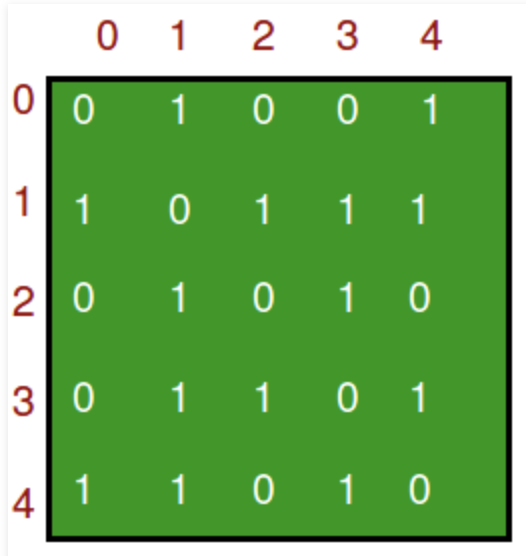
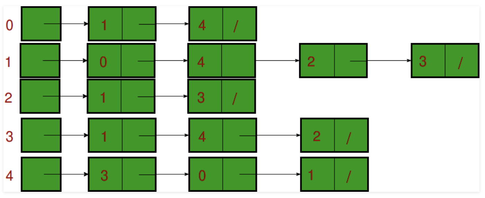

### Graph and its representations
- Graph is a data structure that consists of following two components:
  1. A finite set of vertices also called as nodes.
  2. A finite set of ordered pair of the form (u, v) called as edge. The pair is ordered because (u, v) is not same as (v, u) in case of a directed graph(di-graph). The pair of the form (u, v) indicates that there is an edge from vertex u to vertex v. The edges may contain weight/value/cost.
  
#### Forms
1. Adjacency Matrix
    - Adjacency Matrix is a 2D array of size V x V where V is the number of vertices in a graph. Let the 2D array be adj[][], a slot adj[i][j] = 1 indicates that there is an edge from vertex i to vertex j. Adjacency matrix for undirected graph is always symmetric. Adjacency Matrix is also used to represent weighted graphs. If adj[i][j] = w, then there is an edge from vertex i to vertex j with weight w.
      
2. Adjacency List
    - An array of lists is used. Size of the array is equal to the number of vertices. Let the array be array[]. An entry array[i] represents the list of vertices adjacent to the ith vertex. This representation can also be used to represent a weighted graph. The weights of edges can be represented as lists of pairs. Following is adjacency list representation of the above graph.
      
- There are other representations also like, Incidence Matrix and Incidence List. The choice of the graph representation is situation specific. It totally depends on the type of operations to be performed and ease of use.
